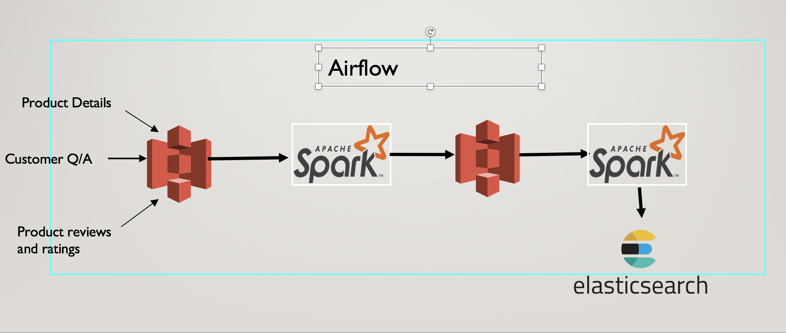

# Virtual-Assisstant
Virtual Assistant that could provide answers user queries related to products.

Motivation:

A frequent visitor of the website knows places from where he could retrieve information on the site. But what about a naive user who has difficulty in finding information on site?.He doesn’t know where to search for. This would make the person to buy product from another source/website and in turn results in revenue loss.

Also even for a frequent visitor who is familiar with the website, if he wishes to find about what are the user’s feedback about the product, he has to grow through all of the reviews.

What if we could build a chatbot that could respond to user queries like
•	To know about product details and features of the product ( For example)
•	Answers based on FAQ’s about the product
•	Finding the best and annoying features of the product (going through all the user reviews)

It would help the user to better know about the product and hence has a viable chance of purchasing it, increase in revenue and better user experience.

Data:

Amazon Product Information

Amazon Reviews and Ratings

Amazon Customer Q/A 

Data Pipeline:

